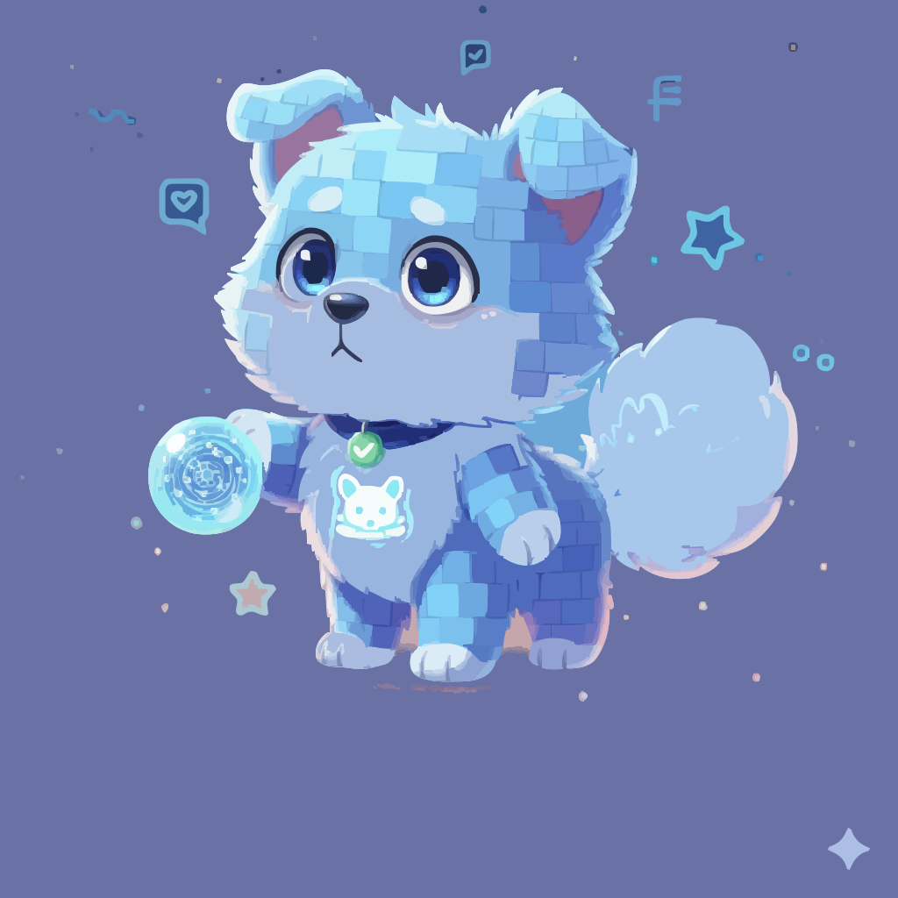

# Meet Wuwu

  

---

### Current Stats

| Attribute | Value |
|------------|--------|
| **Age** | 14 months |
| **Mood** | curious |
| **Health** | 92% |
| **Food** | 90% |
| **Intelligence** | 95% |
| **Knowledge** | 83% |
| **Last Updated** | 2025-11-04 12:44 |

---

### Activity Insights
| Metric | Value |
|---------|-------|
| **Commits Today** | — |
| **Followers** | — |
| **Stars on Main Repo** | — |
| **Public Repos** | — |

---

###  About Wuwu
> Wuwu evolves from my GitHub life — commits feed its mind, stars fuel its energy, and followers shape its personality.  
> The more I build, the smarter and stronger Wuwu grows.

---

Updated automatically by:-

[GitHub Actions](.github/workflows/wuwu.yml)